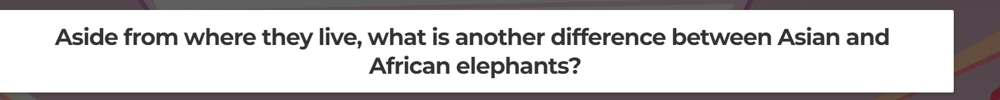
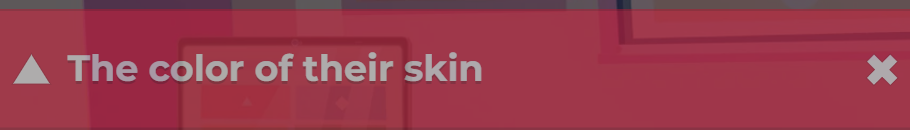
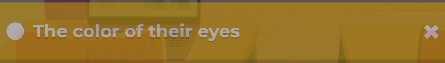
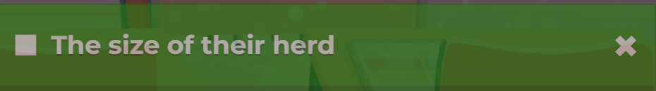

# Kahoot Solver 
This scripts helps to answer Kahoot Questions that are in the the classic mode. This only works on 4 answers Kahoot style questions.

## Prerequisites

- Python 3.6 or above
- Tesseract OCR
- OpenAI API key

## Installation & Setup

1. Clone the repository
2. Install the necessary Python packages with `pip install -r requirements.txt`
3. Download Tesseract from [here](https://github.com/tesseract-ocr/tessdoc). Remember the path where `tesseract.exe` is located.
4. Update the `pytesseract.pytesseract.tesseract_cmd` in `test.py` &  `Kahoot-Solver.py` with your path to `tesseract.exe`.

## Using the Program
1. Update the coordinates in `test.py` and test it using `python test.py`.
Your Screenshots should look like:
### Question:

### Answer 1:

### Answer 2:

### Answer 3:

### Answer 4:

3. Take those coordinates and update them in `Kahoot-Solver.py`.
4. Launch your Kahoot game and make sure it's visible on your screen.
5. Run the script with this command: `python Kahoot-Solver.py` 
6. Press `ctrl+alt+t` and let the solver ask OpenAI for you 

## Notes
📝 The script utilizes screen coordinates for identifying the areas to capture screenshots for both questions and answers. Adjustments might be necessary if your screen resolution differs or if Kahoot's layout undergoes changes.

🤖 The bot relies on informed assumptions derived from the data it receives. There is no absolute guarantee that it will consistently provide accurate answers, particularly when questions involve visual elements like images or videos.
